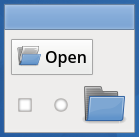
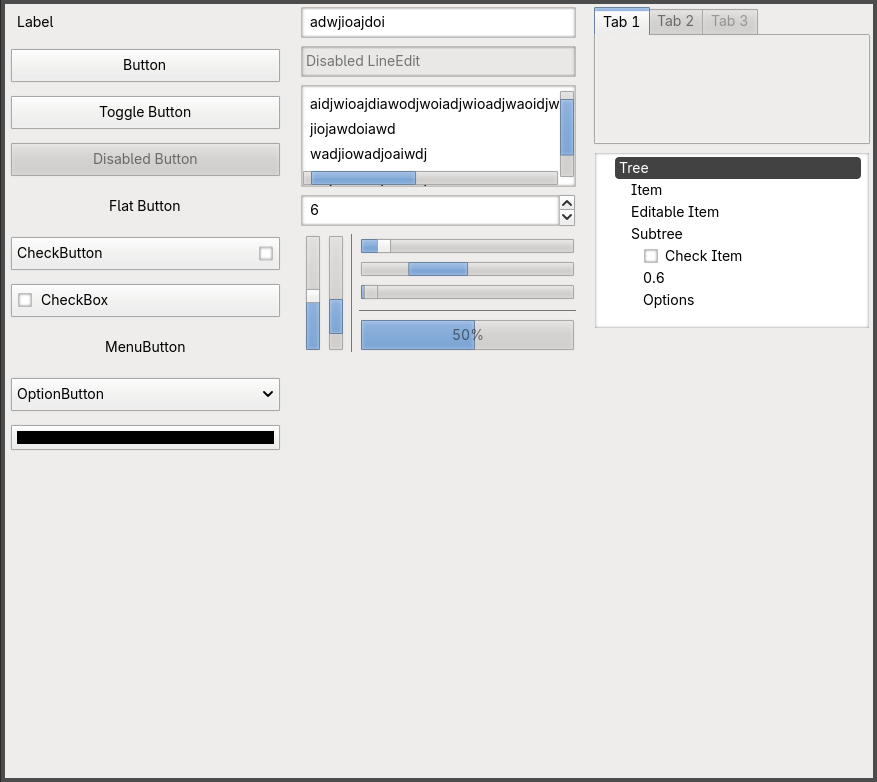

# Clearlooks theme for Godot

This is a UI theme which aims to replicate the clearlooks style reminiscent of 
early 2000s Linux/Unix-like systems for use in games or other projects made with
Godot.

## Preview

As you notice, it is not a perfect recreation of Clearlooks. 
Some elements aren't themed (such as the Tree node).

## Unlicense

This is free and unencumbered software released into the public domain.